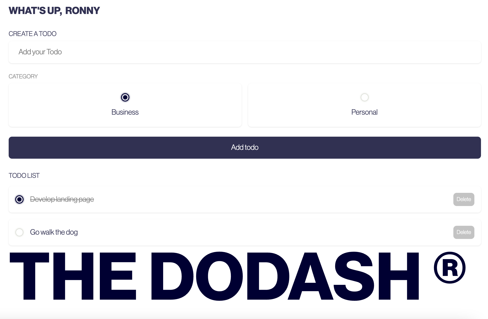

# Dodash with Vue 3 + Vite

## Overview
Dodash is a sleek and intuitive to-do list application designed to help you stay organized and productive. With its user-friendly interface and robust features, managing your tasks has never been easier.

 
## Features
- **Task Management:** Create, edit, and delete tasks effortlessly.
- **Prioritization:** Assign priority levels to tasks to focus on what matters most.
- **Due Dates:** Set due dates and reminders to ensure tasks are completed on time.
- **Categories:** Organize tasks into customizable categories for better organization.
- **Collaboration:** Share lists with friends, family, or colleagues for seamless collaboration.
- **Sync Across Devices:** Access your to-do lists from anywhere with automatic synchronization across devices.
- **Customization:** Personalize the app with themes and customizable settings to suit your preferences.
- **Cross-Platform:** Available on web, desktop, and mobile platforms for convenience.

## How It Works
1. **Create Tasks:** Add new tasks with a title, description, due date, and priority level.
2. **Organize:** Group tasks into categories or projects for better organization.
3. **Prioritize:** Mark tasks as high, medium, or low priority to focus on important tasks first.
4. **Stay on Track:** Set reminders and due dates to stay on top of your tasks.
5. **Collaborate:** Share lists with collaborators to work together on projects or tasks.
6. **Stay Connected:** Access your to-do lists from any device with automatic synchronization.

## Get Started
Download Dodash today and take control of your tasks like never before!

&copy; Ronny Ebnoether

